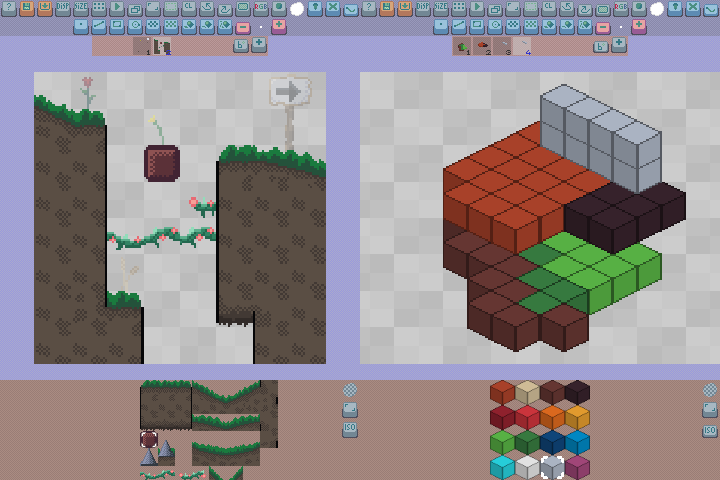

# Pixelc
An opensource tile/sprite editor in C, using SDL2 and OpenGL.


> Main target are touch devices such as smartphones and tablets.
> Runs also fine on desktops.

Based on [some](https://github.com/renehorstmann/some) framework.

## Android App
Pixelc in the [Google Play](https://play.google.com/store/apps/details?id=de.horsimann.pixelc).

## WebApp
[Pixelc WebApp](https://renehorstmann.github.io/pixelc) compiled with emscripten.

> Add the WebApp in your browser to the homescreen, to get the real WebApp fullscreen feeling.

App:


## Tutorial
A documentation / tutorial can be found [here / doc.md](doc.md)


Or just use the tooltip tool. 

## Highlights:
- Multitouch Mode for a great touch experience
- Full mobile friendly [WebApp](https://renehorstmann.github.io/pixelc) compiled with emscripten
- Frames and a .gif export
- Layers
- Onion Skinning for frames and layers
- Multiple drawing modes
- Shading
- Selections
- Undo and Redo system that also works on App reload
- 9 Image Tabs
- Contains the most popular [LOSCPEC](https://lospec.com/palette-list) palettes
- Custom Brush / Kernel / Stamps
- Custom Palettes
- **COMPLETELY FREE and open**
- Mod Tilec for a tileset editor (+ isometric view)
- and many more

## Web Image Upload Zoom Bug
Zoomed in on your Browser while asked for an image upload?
try:
- use desktop version in your browser to reset the size
- empty the browser cache/data (for the Pixelc App)

If you know someone who speaks html better than me, tell me :)

Using the html option `user-scalable=no` will create a smaller canvas size on phones, which looks washed due to linear scaling. 
Also not all browsers disable zoom (like the Samsung Internet Browser)

## Install and run on Desktop
Have a look at the section of [some](https://github.com/renehorstmann/some).


## Compiling for Web
Using Emscripten https://emscripten.org/
Tested under Ubuntu and WSL Ubuntu.
You should have already cloned the project and `cd` to that dir:

- Create a sub-directory to compile the website
```sh
mkdir web && cp index.html web && cp icon/* web && cd web
```

- Copy all resources, because emscripten may not be able to use `../res`
```sh
cp -r ../res .
```

- Compile
```sh
emcc -O3 \
-I../include/ \
-s USE_SDL=2 -s USE_SDL_IMAGE=2 -s FULL_ES3=1 -s \
EXPORTED_FUNCTIONS='["_main", "_e_io_idbfs_synced", "_e_io_file_upload_done"]' \
-s EXPORTED_RUNTIME_METHODS=FS \
-s SDL2_IMAGE_FORMATS='["png"]' \
--preload-file ./res \
-s ALLOW_MEMORY_GROWTH=1 -s ASYNCIFY=1 -s EXIT_RUNTIME=1 \
-lidbfs.js \
-DPLATFORM_EMSCRIPTEN -DOPTION_GLES -DOPTION_SDL \
../src/e/*.c ../src/p/*.c ../src/r/*.c ../src/u/*.c ../src/*.c ../src/dialog/*.c ../src/tool/*.c \
-o index.js
```

- Test the website (open a browser and call localhost:8000)
```sh
python3 -m http.server --bind localhost  # [port]
```

## Mod
Pixelc has a little and stupid modding system.
Have a look at [mod.h](include/mod.h).

### Mod Tilec



> Create tilesets for 2d games in a 2d or 3d isometric grid!

To use the **Tilec** Mod, set `MOD_TILEC true` in the [CMakeLists.txt](CMakeLists.txt) configuration file.

Tilec loads up to 128 tilesheets from `tiles/tile_XX.png` in the working directory of Pixelc

To change the dir or the tile size, see [mod_tiles.h](src/mod/tilec/mod_tiles.h).

The 3d isometric renderer assumes that each layer is a z-layer.
So layer 1 is the bottom floor. 

Result of Tilec is an image .png file, in which each color is a code to the tile.
- Color code for transparency: `0, 0, 0, 0`
- Color code for a tile: `tile_file_id, x, y, 255`

> Currently not supported as App.
> If you want to use it directly on Android, 
> have a look at the install section of [some](https://github.com/renehorstmann/some) /CxxDroid

## Author
René Horstmann

## Licence
- The app and its assets are licenced under GPLv3, see LICENCE.
- The [some](https://github.com/renehorstmann/some) framework is under MIT licence, see someLICENCE.
    - [SDL2](https://www.libsdl.org/) (zlib License)
    - [Emscripten](emscripten.org) (MIT License)
    - [nuklear](https://github.com/Immediate-Mode-UI/Nuklear) for debug gui windows (MIT License) 
      - not used in Pixelc, but is part of some
    - [curl](https://curl.se/docs/copyright.html) (MIT like License) 
      - not used in Pixelc, but is part of some
    - [sfd](https://github.com/rxi/sfd) for simple file dialogs (MIT License)
- the .gif encoder [gifenc](https://github.com/lecram/gifenc) is licenced under public domain
- Have a look at [some_examples](https://github.com/renehorstmann/some_examples) for some shared modules, under the MIT licence
