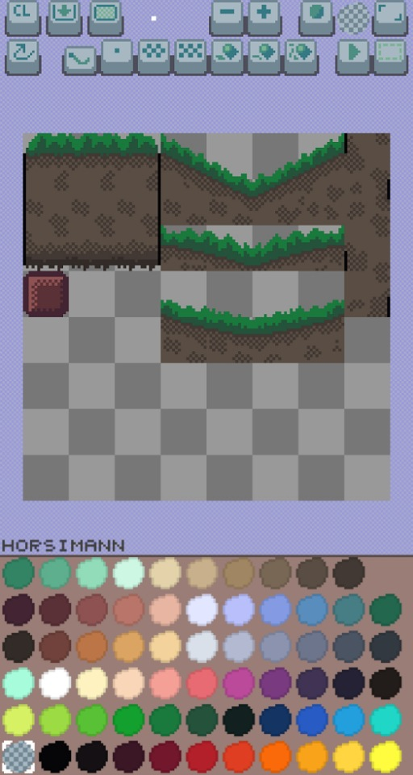

# Pixelc
An opensource tile/sprite editor in C, using SDL2 and OpenGL, also running on Android.

Based on [some](https://github.com/renehorstmann/some) framework.

Have a look at [Tilec](https://github.com/renehorstmann/Tilec) for a forked tile map editor.

## Live demo
Compiled with emscripten [live demo](https://renehorstmann.github.io/pixelc)
Lots of features are missing in the web demo! (Loading, Saving, options like size, ...)

## Status:
Ready to draw..
Save via the save tools to image.png or image_hd.png.
Load image.png as selection.
Canvas size, animation size can be configured in code (main.c).



## Install and run on Desktop
Have a look at the section of [some](https://github.com/renehorstmann/some)


## Compiling for Web
Using Emscripten https://emscripten.org/
Tested under Ubuntu and WSL Ubuntu.
You should have already cloned the project and `cd` to that dir:

- Create a sub directory to compile the website
```sh
mkdir web && cp index.html web && cp icon/* web && cd web
```

- Copy all resources, because emscripten may not be able to use `../res`
```sh
cp -r ../res .
```

- Compile
```sh
emcc -O3 \
-I../include/ \
-s USE_SDL=2 -s USE_SDL_IMAGE=2 -s FULL_ES3=1 -s \
EXPORTED_FUNCTIONS='["_main", "_e_io_idbfs_synced", "_e_io_file_upload_done"]' \
-s EXPORTED_RUNTIME_METHODS=FS \
-s SDL2_IMAGE_FORMATS='["png"]' \
--preload-file ./res \
-s ALLOW_MEMORY_GROWTH=1 -s ASYNCIFY=1 -s EXIT_RUNTIME=1  \
-lidbfs.js \
-DOPTION_GLES -DOPTION_SDL \
../src/e/*.c ../src/p/*.c ../src/r/*.c ../src/u/*.c ../src/*.c \
-o index.js
```

- Test the website (open a browser and call localhost:8000)
```sh
python3 -m http.server --bind localhost  # [port]
```


# Todo
- some big update
  - remove all unecessary "classes" with simple init modules, in some and the games
  - decouple rhc?
    - or:
      - update some rhc files
      - rhc styleguide update?
    - new base module instead of rhc

- dialog background drawn
  - with titel bar
  - nice big shadow
  - 3 parts (width is fixed)
    - top with title bar
    - flexible middle (flex in height of course)
    - bottom part

- reset camera with camera size and actual main (midscreen) rect (90%)


- dialog and tool in a sub dir with a file for each class
  - default member and static function names

- rethink layers and frames?

- tablet size dialog to big (dialog offset y?)
- undo layer change bug
- dialog:
  - delete
  - upload
- tools
  - layer
    - setting for onion skinning alpha
    - add layer behind (+)
    - delete current layer (-)
    - merge layer down
    - toggle for save merged
      - or always sace merged and a butten for save unmerged?
  - delete current palette
    - are you sure prompt
  - delete current kernel
    - are you sure prompt
  - import new palette...?
  - import new kernel
  - reset all
- preview
  - instead of animation
  - how to animate
  - frame times?
  - gif export?
- options menu
  - in container stack
  - shows all tools
  - tools can be used (maybe not all? (tooltip))
  - tools can be en/disabled
  - tools can be repositioned (uo down)

- tiles
  - file containing tile names?
  - direct draw mode, in which you can select a tile in the canvas and directly draw changes there
- Frame Selection? (or grid shows frames?)
- background image option?


## Author
René Horstmann

## Licence
- The app and its assets are licenced under GPLv3, see LICENCE.
- The [some](https://github.com/renehorstmann/some) framework is under MIT licence, see someLICENCE.
- Have a look at [some_examples](https://github.com/renehorstmann/some_examples) for some shared modules, under the MIT licence
