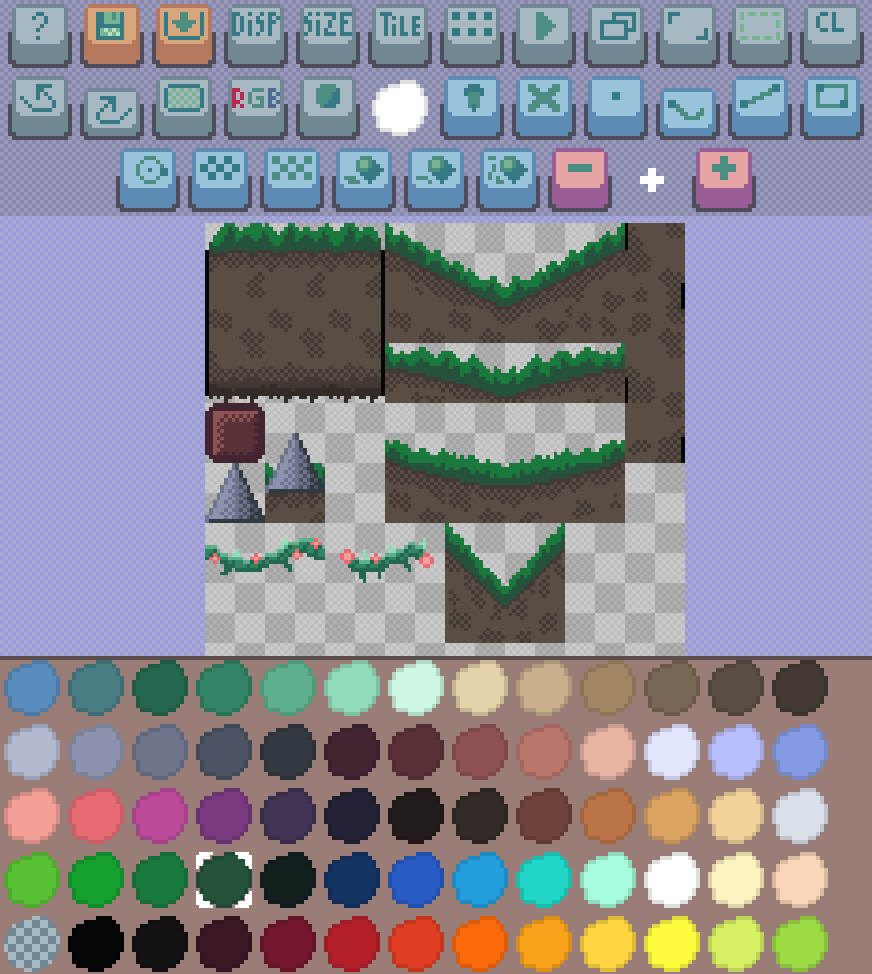

# Pixelc
An opensource tile/sprite editor in C, using SDL2 and OpenGL

**Also runs on fine on smartphones on web browsers**

Based on [some](https://github.com/renehorstmann/some) framework.

Have a look at [Tilec](https://github.com/renehorstmann/Tilec) for an old forked tile map editor.


## Web version
[Pixelc WebApp](https://renehorstmann.github.io/pixelc) compiled with emscripten 

## Status:
Ready to draw...



## Install and run on Desktop
Have a look at the section of [some](https://github.com/renehorstmann/some)


## Compiling for Web
Using Emscripten https://emscripten.org/
Tested under Ubuntu and WSL Ubuntu.
You should have already cloned the project and `cd` to that dir:

- Create a sub directory to compile the website
```sh
mkdir web && cp index.html web && cp icon/* web && cd web
```

- Copy all resources, because emscripten may not be able to use `../res`
```sh
cp -r ../res .
```

- Compile
```sh
emcc -O3 \
-I../include/ \
-s USE_SDL=2 -s USE_SDL_IMAGE=2 -s FULL_ES3=1 -s \
EXPORTED_FUNCTIONS='["_main", "_e_io_idbfs_synced", "_e_io_file_upload_done"]' \
-s EXPORTED_RUNTIME_METHODS=FS \
-s SDL2_IMAGE_FORMATS='["png"]' \
--preload-file ./res \
-s ALLOW_MEMORY_GROWTH=1 -s ASYNCIFY=1 -s EXIT_RUNTIME=1 \
-lidbfs.js \
-DPLATFORM_EMSCRIPTEN -DOPTION_GLES -DOPTION_SDL \
../src/e/*.c ../src/p/*.c ../src/r/*.c ../src/u/*.c ../src/*.c ../src/dialog/*.c ../src/tool/*.c \
-o index.js
```

- Test the website (open a browser and call localhost:8000)
```sh
python3 -m http.server --bind localhost  # [port]
```


# Todo

- sprites
  - 2d grid
    - in x and y, must be %0 with image size
    - else will be turned off
  - animate mode:
    - off - via preview btn
    - only x+
    - only y+
    - x+ than y+
    - y+ than x+
  - sprite frame time
    - reset for all
      - time or fps
    - edit individual frame time?
      - extra dialog?
  - canvas render mode:
    - sprite grid line
    - + current sprite with onion skinning the previous
      - only if animate_mode!=off
  - add row/col buttons
    
- dialog colors, toolbar colors
  - or drawn

- tutorial.md
  - what how to do
    - how to create a palette
    - how to use a palette from lospec
  - multitouchmode
  - images
  - disp, etc. explained  
  
- tiles
  - file containing tile names?
  - direct draw mode, in which you can select a tile in the canvas and directly draw changes there
- background image option?


## Author
René Horstmann

## Licence
- The app and its assets are licenced under GPLv3, see LICENCE.
- The [some](https://github.com/renehorstmann/some) framework is under MIT licence, see someLICENCE.
- Have a look at [some_examples](https://github.com/renehorstmann/some_examples) for some shared modules, under the MIT licence
