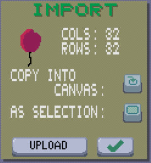

# Pixelc Tutorial
Welcome to the [Pixelc](https://github.com/renehorstmann/pixelc) tutorial.

Pixelc is a free pixelart editor for multiple platforms, including a [WebApp](https://renehorstmann.github.io/pixelc).

The main target are touch devices such as smartphones and tablets (also via the [WebApp](https://renehorstmann.github.io/pixelc)).
Its also fine to use on desktops, etc.

> Touch-Users: Use the [Multitouchmode](#S-multitouchmode) for a great user experience!

> Big Screen? Change the internal [Display](#S-display) size

> Add the WebApp in your browser to the homescreen, to get the real WebApp fullscreen feeling

## Table of Contents
- [Draw Modes](#S-draw_modes)
- [Tooltip](#S-tooltip)
- [Palette](#S-palette)
  - [How to edit a palette](#S-palette__edit)
  - [How load a palette from a file](#S-palette__load)
- [Multitouchmode](#S-multitouchmode)
- [Kernel](#S-kernel)
  - [New Brush Size](#S-kernel__brush)
  - [Stamps](#S-kernel__stamps)
- [Funny Rainbow Trick](#S-rainbow)
- [Secondary Color](#S-secondary_color)
- [Shading](#S-shading)
- [Display Settings](#S-display)
- [Save](#S-save)
- [Import](#S-import)
- [Selection](#S-selection)
- [Image Tabs](#S-image_tabs)
- [Frames](#S-frames)
- [Layers](#S-layers)

## Draw Modes
Pixelc supports different modes to draw on the canvas.
### Free

Draws freely on the canvas (default mode).
### Dot

Draws on each tip.
Good to print [stamps](#S-kernel__stamps) on the canvas.
### Line

Draws a line on the canvas.
### Rect

Draws a rect on the canvas.
### Circle

Draws a circle on the canvas.
Start position is the circle center.
### Grid

Draws the current [Kernel](#S-kernel) in a grid on the canvas.
Only makes sense for a dithering kernel.

### Inverted Grid

As Mode Grid, but inverts the colors of the [Kernel](#S-kernel).
So you can fill the opposite colors as with the normal Grid mode.
Only makes sense for a dithering kernel.

### Fill 4

Fills a touched color with mode 4.
In mode 4, the left, right, top and bottom next pixels are checked for the same color.
Good to fill blobs of pixels.

### Fill 8

Fills a touched color with mode 8.
Mode 8 also checks the diagonal corners (so checking 8 fields).
Good to replace thin lines.

### Replace

Replaces the touched color.
### None

Does nothing on the canvas. Use this mode if you just want to view your pixel art, without accidentally drawing on it.
### Pipette

Click on a color in the canvas to set it as [secondary color](#S-secondary_color). 
The app shows a flash effect of that color to show you that the pipette mode is active.
(Also if [shading](#S_shading) is active)

## Tooltip

Click on the tooltip tool in the toolbar to show tooltips for pressed tools

You can now click on a tool (or the palette) to get some tipps.
Click on the tooltip button again to stop the tooltips.

## Palette
### Side Swipe to change
Swipe to the left or right on the palette, to change to the previous or next palette.

### Up Swipe for Multitouchmode
See [Multitouchmode](#S-multitouchmode).
### Hold for Options
Press on the palette for some time to start the palette dialog.

In this dialog you can:
-  delete the current palette
-  copy the current palette as image into the canvas
  - will overwrite the full image (use undo to reset to the old)
  - Good to edit the palatte in the canvas
-  Set a (new) palette from the current canvas image
  - Will overwrite the palette with the blue name or create a new one
    - click on the blue name to edit the new palette name

### How to edit a palette
1. use a new image tab 
2. hold down on the palette to open the palette dialog
3. copy the current palette into the canvas 
4. change the size to add new colors, or replace the colors in the canvas. Use the RGB tool to draw with a custom color 
5. hold down on the palette again to open the palette dialog
6. (optional) rename the palette name to a new one
7. set palette from canvas (duplicate colors are ignored, up to 128 colors) 

### How to load a palette from a file
1. Download a palette file as png (for example from [LOSCPEC](https://lospec.com/palette-list) PNG Image 1x)
2. use a new image tab 
3. hold down on the import button 
4. in the import dialog, load the image and press "copy into canvas" 
5. hold down on the palette again to open the palette dialog
6. (optional) rename the palette name to a new one
7. set palette from canvas (duplicate colors are ignored, up to 128 colors) 

## Multitouchmode
> Makes editing pixelart on touch devices a great experience!

To start, swipe with your thumb (or a finger) up from the palette.
Hold down that finger and move to move the cursor.
Use a second thumb (or finger...) to press the cursors "button".
You can also press the buttons in the toolbar and in the dialogs, too!

## Kernel
The Kernel is drawn in the Modes: Free, Dot, Line, Rect, Cricle, Grid and InvertedGrid.

Change the current kernel with the minus and plus button. Hold for the first, last kernel  

If you hold on the kernel preview between minus and plus, the kernel options dialog starts.

In this dialog you can:
-  delete the current kernel
-  copy the current kernel as image into the canvas
  - will overwrite the full image (use undo to reset to the old)
  - Good to edit the palatte in the canvas
-  Create a new kernel from the current canvas image

### New Brush Size
1. use a new image tab 
2. Change canvas size to the desired kernel size 
3. Draw a white circle in the canvas and fill it white
4. Hold on the Kernel preview to start the kernel dialog
5. Create a new kernel from the current canvas image 
6. Draw with your new brush

### Stamps
You can also use kernels as image stamps to quickly draw your stamps in different colors:
1. use a new image tab 
2. Draw your stamp in white, gray and black (other colors work to, the resulting color is `kernel color * palette color`)
3. Hold on the Kernel preview to start the kernel dialog
4. Create a new kernel from the current canvas image 
5. Select a color from the palette
6. Use the Dot Mode 
7. Draw your stamp

Lets draw a fish as a stamp in grayscale.

We can now print the fish in different colors onto our image.

##  Funny Rainbow Trick
Just to show you what kernels can do for you:

Choose a palette for the rainbow and copy it into the canvas (or draw your own rainbow)

Create a kernel from that canvas and draw your rainbow.

## Secondary Color
An additional color to set and choose from, apart from the palette.

To use it just tip on the tool in the toolbar.

To set the secondary color:
- select a color from the palette and hold down on the secondary color tool to copy it
- click on the RGB tool to change the current selected color and set it as secondary color 
- use the pipette tool and click to the desired color on the canvas 

## Shading 

Shading is useful to only paint above a selected color, to shade or highlight edges.

1. set the secondary color 
2. activate the shading mode 
3. draw the shades

The app shows a flash effect of the secondary color to show you that the shading mode is active.
(Also if the pipette [draw mode](#S_draw_modes) is used)

## Display settings

Click on the display tool to open the display dialog.

Pixelc is rendered in pixel perfect render mode.
In that mode, each pixel unit is drawn with an integer number of real pixels.
The size determines the minimum drawn pixel units in the window.

So a small change may not alter the size of a pixel unit.

Click on the mobile or desktop/tablet button next to the size, to set it to 180 or 270.

The rotate mode is in portrait mode as default.
- In the Portrait Mode, the toolbar is at the top of the window and the palette on the bottom.
- In Landscape Mode, the toolbar is aligned left and the palette right.
- Auto Mode uses the window size to select the mode.

## Save

Click on the save tool to open the save dialog.

You can save either as `.png` image file or as animated `.gif` file.
On the web, the files are offered as download.
Otherwise the files are saved as `image.png` or `animation.gif` in the working directory of the executable.

 Save the image with the actual size.

 Upscale the image to at least *HD MIN SIZE*.
Better for sharing the image, because most image viewer will render pixel art wrong.

If *SAVE LAYERS MERGED* is activated, all layers are merged into a single image.

*PNG* will save the frames next to each other, while *GIF* will animate them.

> The gif encoder uses a color palette with max. 256 opaque colors. Color 0 is reserved for transparency.
> The first 255 colors in the canvas are used to create the color palette.

## Import

Click on the import tool to open the `import.png` image file as [selection](#S-selection).

Hold to open the import dialog.

In the WebApp you can upload a new file to be loaded as import.png.

Otherwise the file should be located in the working directory of the executable.

The button copy into canvas 
Will copy the image into the canvas directly.

> Zoomed in on your Browser while asked for an image upload?
> try:
> - use desktop version in your browser to reset the size
> - empty the browser cache/data (for the Pixelc App)

If you know someone who speaks html better than me, tell me :)

## Size

Click on the size tool to open the size dialog.

If keep order is NOT activated (default), the image will be reset as there where no frames or layers.
Frames are placed side by side to the right in the image. Layers are placed below.
> Good to load an image with frames and set the size and frames to match the image.
> For example the image has 128 cols and 4 frames, so 32 cols per frame.
> Reset COLS to 32 and FRAMES to 4 to morph the image into the frames system.

If keep order is activated, the image will be reset with the frames and layers individually copied.
> Good to resize the actual frame size.

## Selection

Click on the selection tool, to start a new selection.

Now swipe down on the canvas to create the selection window.

You can now move the selection borders with the arrow keys on the left in the selection toolbar.

While a selection is active, all drawing stuff is only applied inside the selection box.

The copy button copies the current selection.

The cut button cuts the current selection and replaces it with transparency.

The crop button crops the canvas onto the current selection (removing everything outside the selection).

If copied or cut, the selection box may be moved on the canvas or in a new frame, layer or image tab.

In the new selection toolbar, the selection box may be rotated or flipped.

The copy button now copies the selection into the canvas, leaving the selection toolbar open.

The ok button copies the selection into the canvas and closes the selection mode.

If the blend button is activated, the selections will be blended onto the canvas (using transparency).

## Image Tabs

You can select up to nine different image tabs via the tab tool.

## Frames

Open the frames toolbar and show the animated preview.

If not activated, the frames are side by side on the canvas.

Click on the grid tool, to show the frame grid in the full image 

If activated, the frames can be selected in the frames toolbar:

Select a frame via the preview.

Switch between the three blend modes:
1. Off, only render the current frame
2. Onion skinning, blend in previous frames with a low transparency (alpha) value
3. Full, blend in previous frames with the full alpha value

Add a new frame right next to the current.

Hold on a frame to open the frame dialog:

Here you can:
- delete the current frame 
- move the current frame left or right  
- merge the frame with the previous frame 
- set the frame time for the animation

Hold on the frames tool to open the animation dialog 

Here you can:
- reset the animation size
- repeat the animated preview horizontally or vertically or both 
  - good to show repeated tiles
- reset all frame times via seconds or fps 

## Layers
Frames and layers both are located in a grid of the image.
While frames are set right next to each other on the image, layers are placed below each other.
The layer options behave exactly the same as the frame options (without the animation dialog and the frame times)
So have a look at the [Frames](#S-frames) section.
Layers may be merged down in the save dialog 
