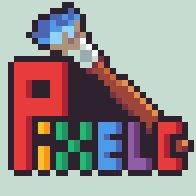
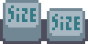
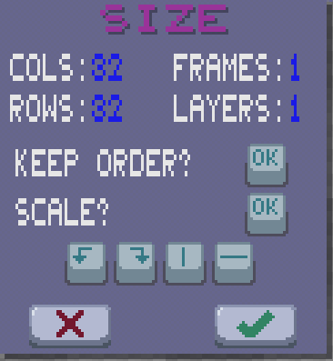
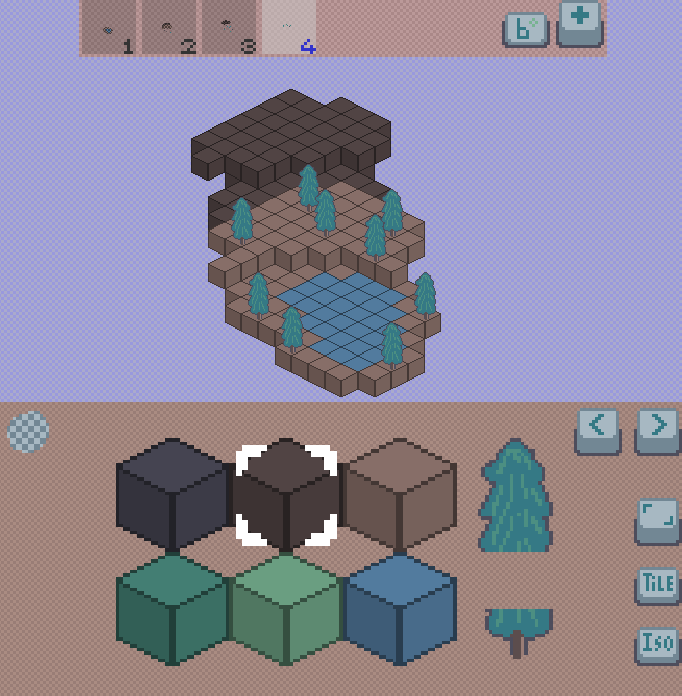
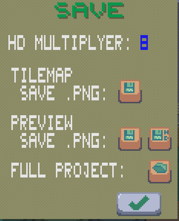
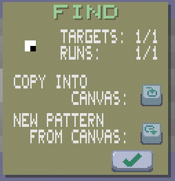
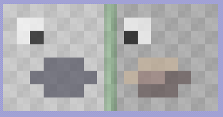
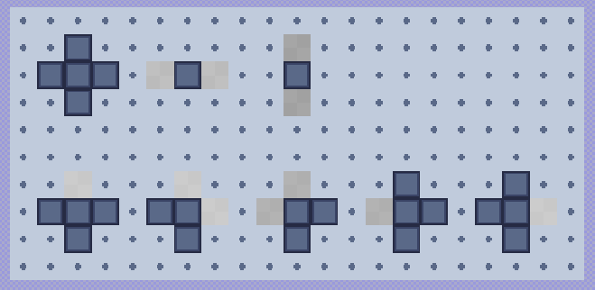

# Pixelc Tutorial
Welcome to the [Pixelc](https://github.com/renehorstmann/pixelc) tutorial.



Pixelc is a free pixelart editor for multiple platforms, including a [WebApp](https://renehorstmann.github.io/pixelc).

The main target are touch devices such as smartphones and tablets 
(via the [WebApp](https://renehorstmann.github.io/pixelc) or as Android App on [Google Play](https://play.google.com/store/apps/details?id=de.horsimann.pixelc)).

Its also fine to use on desktops, etc.

> Touch-Users: Use the [Multitouch Mode](#multitouch-mode) for a great user experience!

> Big Screen? Change the internal [Display](#display-settings) size

> Add the WebApp in your browser to the homescreen, to get the real WebApp fullscreen feeling


## App


## Table of Contents
- [Draw Modes](#draw-modes)
- [Tooltip](#tooltip)
- [Palette](#palette)
  - [How to edit a palette](#how-to-edit-a-palette)
  - [How load a palette from a file](#how-to-load-a-palette-from-a-file)
  - [Create your own palette, fast](#create-your-own-palette-fast)
- [Multitouch Mode](#multitouch-mode)
- [Kernel](#kernel)
  - [New Brush Size](#new-brush-size)
  - [Kernel Stamps](#kernel-stamps)
- [Funny Rainbow Trick](#funny-rainbow-trick)
- [Secondary Color](#secondary-color)
- [Shading](#shading)
- [Display Settings](#display-settings)
- [Grid](#grid)
- [Save](#save)
- [Import](#import)
- [Selection](#selection)
  - [Create Selection](#create-selection)
  - [Paste Selection](#paste-selection)
  - [Selection Stamps](#selection-stamps)
- [Image Tabs](#image-tabs)
- [Frames](#frames)
- [Layers](#layers)
- [Project Archive](#project-archive)
- [Tiles](#tiles)
  - [Isometric Mode](#isometric-mode)
  - [How to edit a tilesheet](#how-to-edit-a-tilesheet)
  - [How to load a tilesheet from a file](#how-to-load-a-tilesheet-from-a-file)
  - [Tile saving and color codes](#tile-saving-and-color-codes)
- [Find and Replace / Autotile](#find-and-replace)

## Draw Modes
Pixelc supports different modes to draw on the canvas.
### Free


Draws freely on the canvas (default mode).
### Dot


Draws on each tip.
Good to print [Kernel Stamps](#kernel-stamps) on the canvas.
### Line


Draws a line on the canvas.
### Rect


Draws a rect on the canvas.
### Circle


Draws a circle on the canvas.
Start position is the circle center.
### Grid


Draws the current [Kernel](#kernel) in a grid on the canvas.
Only makes sense for a dithering kernel.


### Inverted Grid


As Mode Grid, but inverts the colors of the [Kernel](#kernel).
So you can fill the opposite colors as with the normal Grid mode.
Only makes sense for a dithering kernel.


### Fill 4


Fills a touched color with mode 4.
In mode 4, the left, right, top and bottom next pixels are checked for the same color.
Good to fill blobs of pixels.


### Fill 8


Fills a touched color with mode 8.
Mode 8 also checks the diagonal corners (so checking 8 fields).
Good to replace thin lines.


### Replace


Replaces the touched color.

### Outline


Creates an outline with the pressed color.
Uses the kernel to determine if a pixel belongs to the outline.
Functions like the "opening/closing" computer vision algorithm.

> A 1x1 kernel will be replaced by a 3x3 "+" kernel


### None


Does nothing on the canvas. Use this mode if you just want to view your pixel art, without accidentally drawing on it.
### Pipette


Click on a color in the canvas to set (and select) it as [secondary color](#secondary-color). 
The app shows a flash effect of that color to show you that the pipette mode is active.
(Also if [shading](#shading) is active)

- If the button is half pressed, the last active draw mode will be reset, if a color was picked.
- If full pressed, the pipette mode stays active

## Tooltip


Click on the tooltip tool in the toolbar to show tooltips for pressed tools


You can now click on a tool (or the palette) to get some tipps.
Click on the tooltip button again to stop the tooltips.

## Palette
### Side Swipe to change
Swipe to the left or right on the palette, to change to the previous or next palette.

You can also use the mouse wheel to switch palettes, when the cursor is above it.


### Up Swipe for Multitouch Mode
See [Multitouch Mode](#multitouch-mode).
### Hold for Options
Press on the palette for some time to start the palette dialog.


In this dialog you can:
-   delete the current palette
-   copy the current palette as image into the canvas
  - will overwrite the full image (use undo to reset to the old)
  - Good to edit the palatte in the canvas
-   Set a (new) palette from the current canvas image
  - Will overwrite the palette with the blue name or create a new one
    - click on the blue name to edit the new palette name

### How to edit a palette
1.   use a new image tab
2. hold down on the palette to open the palette dialog
3.   copy the current palette into the canvas
4. change the [size](#size) to add new colors, or replace the colors in the canvas. 
   -   Use the RGB tool to draw with a custom color
5. hold down on the palette again to open the palette dialog
6. (optional) rename the palette name to a new one
7.   set palette from canvas (duplicate colors are ignored, up to 128 colors) 

### How to load a palette from a file
1. Download a palette file as png (for example from [LOSCPEC](https://lospec.com/palette-list) PNG Image 1x)
2.   use a new image tab
3.  click on the import button 
4.   in the import dialog, load the image and press "copy into canvas" 
5. hold down on the palette to open the palette dialog
6. (optional) rename the palette name to a new one
7.   set palette from canvas (duplicate colors are ignored, up to 128 colors) 

### Create your own palette, fast
1.   use a new image tab, or use the top of your image
2. Draw some shades of gray
3. Use the [Selection](#selection) tool to crop your shades 


4. Create new [Kernel Stamp](#kernel-stamps) of that image
5.   use a new image tab, or click undo 
6. Select a bright color with the RGB tool 
7. Draw the kernel with the custom color
8. Repeat until your palette is finished
9. Crop to your custom palette and set it like in ["How to edit a palette"](#how-to-edit-a-palette)


> You can also use [Selection Stamps](#selection-stamps) to draw the color shades

## Multitouch Mode
> Makes editing pixelart on touch devices a great experience!

To start, swipe with your thumb (or a finger) up from the palette.
Hold down that finger and move to move the cursor.
Use a second thumb (or finger...) to press the cursors "button".
You can also press the buttons in the toolbar and in the dialogs, too!


## Kernel
The Kernel is drawn in the Modes: Free, Dot, Line, Rect, Cricle, Grid and InvertedGrid.

 

Change the current kernel with the minus and plus button. Hold for the first, last kernel 


If you hold on the kernel preview between minus and plus, the kernel options dialog starts.


In this dialog you can:
-    delete the current kernel
-    copy the current kernel as image into the canvas
  - will overwrite the full image (use undo to reset to the old)
  - Good to edit the kernel in the canvas
-   Create a new kernel from the current canvas image

### New Brush Size
1.  use a new image tab
2.   Change canvas size to the desired kernel size 
3. Draw a white circle in the canvas and fill it white
4. Hold on the Kernel preview to start the kernel dialog
5.   Create a new kernel from the current canvas image 
6. Draw with your new brush


### Kernel Stamps
Also have a look at [Selection Stamps](#selection-stamps)

You can also use kernels as image stamps to quickly draw your stamps in different colors:
1.   use a new image tab 
2. Draw your stamp in white, gray and black (other colors work, too. The resulting color is `kernel_color * palette_color // [0:1]`)
3. Hold on the Kernel preview to start the kernel dialog
4.   Create a new kernel from the current canvas image 
5. Select a color from the palette. Or use the  RGB tool with a custom color
6.   Use the Dot Mode 
7. Draw your stamp

Lets draw a fish as a stamp in grayscale.


We can now print the fish in different colors onto our image.


##  Funny Rainbow Trick
Just to show you what kernels can do for you:

Choose a palette for the rainbow and copy it into the canvas (or draw your own rainbow)


Create a kernel from that canvas and draw your rainbow.


## Secondary Color
An additional color to set and choose from, apart from the palette.


To use it just tip on the tool in the toolbar.

To set the secondary color:
- select a color from the palette and hold down on the secondary color tool to copy it
-   click on the RGB tool to change the current selected color and set it as secondary color 
-   use the pipette tool and click to the desired color on the canvas 

## Shading 


Shading is useful to only paint above a selected color, to shade or highlight edges.

1. set the secondary color to the color you wish to overdraw
2. select the new color from the palette
3. activate the shading mode
4. draw the shades


The app shows a flash effect of the secondary color to show you that the shading mode is active.
(Also if the pipette [draw mode](#draw-modes) is used)


## Display settings


Click on the display tool to open the display dialog.


Pixelc is rendered in pixel perfect render mode.
In that mode, each pixel unit is drawn with an integer number of real pixels.
The size determines the minimum drawn pixel units in the window.

So a small change may not alter the size of a pixel unit.

Click on the mobile or desktop/tablet button next to the size, to set it to 180 or 270.

The rotate mode is in portrait mode as default.
- In the Portrait Mode, the toolbar is at the top of the window and the palette on the bottom.
- In Landscape Mode, the toolbar is aligned left and the palette right.
- Auto Mode uses the window size to select the mode.

## Grid


Click on the grid tool to add a little transparency to the canvas, so you can see the background grid.

Grid option off (default):


Grid option on:


Hold on the grid tool, to open a dialog in which you can change the pattern size 
and show or hide the entire background grid:


Now with a background chess pattern of a 16x16 size, instead of the default 8x8:


## Save


Click on the save tool to open the save dialog.


You can save either as `.png` image file or as animated `.gif` file.
> The CxxDroid Version saves the files as `image.png` or `animation.gif` in the working directory.

 Save the image with the actual size.

 Upscale the image with the **HD MULTIPLYER**.
Better for sharing the image, because most image viewer will render pixel art wrong.

If **SAVE LAYERS MERGED** is activated, all layers are merged into a single image.

**PNG** will save the frames next to each other, while **GIF** will animate them.

> The gif encoder uses a color palette with max. 256 opaque colors. Color 0 is reserved for transparency.
> The first 255 different colors in the canvas are used to create the color palette.

 Open the [project archive](#project-archive) dialog

## Import


Click on the import tool to open the import dialog.


Click on the **UPLOAD** button to open a file chooser and upload a png image.
> The CxxDroid Version has no file dialog and just trys to load import.png from the working directory.

> Maximal image sizes:
> - 8192*8192
> - 96 Frames
> - 96 Layers
> - 64 MiB image size (~16 million pixel)


The button **COPY INTO CANVAS** 
Will copy the image into the canvas directly.


The button **AS SELECTION** 
will open the image as a [selection](#selection).

> Zoomed in on your Browser while asked for an image upload?
> try:
> - use desktop version in your browser to reset the size
> - empty the browser cache/data (for the Pixelc App)

If you know someone who speaks html better than me, tell me :)

## Size


Click on the size tool to open the size dialog.



If **KEEP ORDER** is NOT activated (default), the image will be reset as there where no frames or layers.
Frames are placed side by side to the right in the image. Layers are placed below.
> Good to load an image with frames and set the size and frames to match the image.
> For example the image has 128 cols and 4 frames, so 32 cols per frame.
> Reset COLS to 32 and FRAMES to 4 to morph the image into the frames system.

If **KEEP ORDER** is activated, the image will be reset with the frames and layers individually copied.
> Good to resize the actual frame size.

If **SCALE** is NOT activated (default), the image size will just be changed
and non-existent areas are filled transparently.

If **SCALE** is activated, the image will be scaled from the old to the new size 
with the *"nearest"* filter setting.

> Good to downscale an (.png) image into pixel art


Toggle the rotate and flip buttons, to manipulate the image after resizing

> Maximal image sizes:
> - 8192*8192
> - 96 Frames
> - 96 Layers
> - 64 MiB image size (~16 million pixel)

## Selection


## Create Selection

Click on the selection tool, to start a new selection.

Now swipe down on the canvas to create the selection window.


You can now move the selection borders with the arrow keys on the left in the selection toolbar.

While a selection is active, all drawing stuff is only applied inside the selection box.


## Paste Selection


The copy button copies the current selection.


The cut button cuts the current selection and replaces it with transparency.


The crop button crops the canvas onto the current selection (removing everything outside the selection).

If copied or cut, the selection box may be moved on the canvas or in a new frame, layer or image tab.


In the new selection toolbar, the selection box may be rotated or flipped.


The copy button now copies the selection into the canvas, leaving the selection toolbar open.


The ok button copies the selection into the canvas and closes the selection mode.


Stop the selection mode to cancel the copying.


If the color button is activated, the current color will be applied on the selection.

See [Selection Stamps](#selection-stamps) below.


If the blend button is activated, the selections will be blended onto the canvas (using transparency).


## Selection Stamps
Also have a look at [Kernel Stamps](#kernel-stamps)

You can also use selections as image stamps to quickly draw your stamps in different colors:
1. Draw your stamp in white, gray and black (other colors work, too. The resulting color is `pixel_color * palette_color // [0:1]`)
2. Create a selection on your drawing (In the image below, its the gift in the black box)
3.  Copy this selection stamp
4.  Activate the color mode
5. Select a color from the palette. Or use the  RGB tool with a custom color
6.  Drag and copy your stamp


## Image Tabs


You can select up to nine different image tabs via the tab tool.


## Frames


Open the frames toolbar and show the animated preview.


If not activated, the frames are side by side on the canvas:


Click on the [grid](#grid) tool, to show the frame grid in the full image:


If activated, the frames can be selected in the frames toolbar:


Select a frame via the preview.

 Switch between the three blend modes:
1. Off, only render the current frame
2. Onion skinning, blend in previous frames with a low transparency (alpha) value
3. Full, blend in previous frames with the full alpha value


Add a new frame right next to the current.

Hold on a frame to open the frame dialog:


Here you can:
-   delete the current frame 
-    move the current frame left or right 
-   merge the frame with the previous frame 
- set the frame time for the animation


Hold on the frames tool to open the animation dialog


Here you can:
- show and hide the animation
- reset the animation size
-   repeat the animated preview horizontally or vertically or both 
  - good to show repeated tiles
-   reset all frame times via seconds or fps 


## Layers
Frames and layers both are located in a grid on the image.
While frames are set right next to each other on the image, layers are placed below each other.
The layer options behave exactly the same as the frame options (without the animation dialog and the frame times)
So have a look at the [Frames](#frames) section.


Layers may be merged down in the save dialog

## Project Archive
Open the project dialog within the [Save](#save) dialog.

>  --> 


 Save the full project as `.tar` archive file.
> The CxxDroid Version saves the file as `project_save.tar` in the working directory.

A project archive contains:
- All 9 tab images
- All 16 tilesheets
- A config file, that includes the tab frames and layers and the tile sizes

Like with the [import](#import) dialog, you can also upload a project archive `.tar` to restore it.
Use the **UPLOAD** button to open the archive file in a file dialog
and click on  to reload it.

> To open a `.tar` file manually, use an archive reader like WinRar, 7zip, etc.


## Tiles


Click on the tile tool to start the tiling mode.


> In the newest version of Pixelc, the tile button has moved into the grid dialog!

The canvas now renders a tile for each pixel unit.

> (WebApp) limitation:
> The tile mode creates large textures on the GPU.
> If the maximal size is reached on your device, the canvas will be rendered with the maximal GPU texture size and your tilemap will get pixelated.
> If thats the case, a warning will be print as tooltip
> Use a smaller canvas size or reduce the layers to avoid this.

### Tile Palette

The palette now shows tilesheets and some additional tools.

You can zoom and move the tilesheet like the canvas.

Tools:
-  Select to clear tiles
-  Previous tilesheet
-  Next tilesheet
-  Reset the tilesheet camera
-  Render the tiles in the canvas
-  Render in [isometric mode](#isometric-mode)

> Pixelc supports up to 16 different tilesheets!

Hold down on the palette to open the tile dialog:


Here you can:
- Reset the size of a single tile for x and y (`8, 16, 32 pixel`)
  - For all tilesheets.
-  Copy the tilesheet into the canvas
  - Good for editing the tilesheet
-  Update the current tilesheet with the canvas image
  - The image size must be a multiple of 32
    - will be filled with transparency to match `%32==0`

### Isometric Mode


If the isometric mode is active, the canvas renders the tiles with isometric overlapping:



In this example, the tilesize is set as 32x32 pixel
> Use layers to define the z-height of your tilemap.
> Layer 1 is the bottom floor.

In the isometric mode, selections are disabled. Turn it off to use them.

#### Rotating the Isometric Tilemap
Want to view your 3D-Tilemap from a different orientation?
1.  Click on the size tool to open the [size](#size) dialog
2.  Rotate the image
3. Enjoy your new view:


### How to edit a tilesheet
1.   use a new image tab
2.  start the tiling mode
3. hold down on the tile palette to open the tile dialog
4.   copy the current tilesheet into the canvas
5. redraw tiles, change the size, draw new tiles, ....
6.  start the tiling mode again
7. (optional) select a different tilesheet to update
8. hold down on the tile palette again to open the tile dialog
9.  update tilesheet from canvas

### How to load a tilesheet from a file
1. Download a tilesheet file as png (for example from [itch](https://itch.io/game-assets/tag-tileset))
2.  use a new image tab
3.  click on the import button
4.   in the import dialog, load the image and press "copy into canvas"
5. (optional) crop the image out to the tiles you want with a [selection](#selection)
6.  start the tiling mode
7. (optional) select a different tilesheet to update
8. hold down on the tile palette to open the tile dialog
9.  update tilesheet from canvas


### Tile saving and color codes
The tilemap is drawn with color codes for each tile.

The color code is built up as:
```
.r = tile_id;
.g = tile_x;
.b = tile_y;
.a = alpha;
```

`tile_id` is one of the 16 tilesheets.

`tile_x & tile_y` are the position in the tilesheet.

 A click on the save tool, opens a new save dialog:



Here you can:
- Save the tilemap with its color codes as .png image
- Save the rendered preview of the tilemap
- Save the rendered preview of the tilemap in HD, using the **HD MULTIPLYER**
-  Open the [project archive](#project-archive) dialog

## Find and Replace


With the find tool, you can search for patterns in your image and replace them.

> When using the right choice of pattern, you can also create **Auto Tiled Maps**!

Long press  to open the find dialog:



In this dialog you can:
-    copy the current pattern as image into the canvas
  - will overwrite the full image (use undo to reset to the old)
  - Good to edit the pattern in the canvas
-   Create a new pattern from the current canvas image

> A pattern needs 2 or more frames!

**TARGETS** is the amount of replace frames (pattern.frames -1)

**RUNS** is the amount of layers in the pattern image. Layers are evaluated one by one.

> If your canvas had frames or layers enabled, only up to the current frame/layer is used as targets/runs in the pattern.
> So thats where these **TARGETS: 1/2** come from: "2 maximal targets, but only the first is used."

In a nutshell, the find tool looks for patterns in the first frame of the pattern image 
and replaces it with the following target frames.

Suppose you have the following image where you want to replace the eyes:


Your pattern image should look like the following:

On the left is the search frame.
On the right the target (position of the eyes must match)


> The first pixel on the top left is the ignore color. Do NOT place your search patterns on that pixel

After pressing the  find tool, the resulting image will look like this:


> The tooltip will show the match and replace results for each run (pattern image layer)

You can also search for multiple patterns:

> Each pattern must have a border (box) of at least 1 pixel in the ignore color (top left pixel color)



The result will look like this:


If you define more than one target frame, the result is randomly chosen:

> Up to valid pattern targets, so the shoe is always replaced with the first target


### Autotiling

The find tool can be used to create auto tile pattern maps.
The default find pattern image is a very simple autotile map for the first default tilesheet:



The ignore color (tile) is here set as the small cross (top left pixel in the pattern image)

> So you can search for transparency as well

> Each pattern must have a border of the ignore colors / tiles!

When the  is pressed on an image like this:


Each pattern is replaced with the next frame in the pattern image:


Turn on blending frame  to see the searched pattern:


> If your pattern image has more than 2 frames, a random frame is used for each match.
> But only if that target has >= 1 not ignored color, else the previous frame is used

The resulting image will look like this:


> The default tileset and autotiling pattern are just to play around.
> If you see a template tile that was not replaced, add that condition to the pattern image
